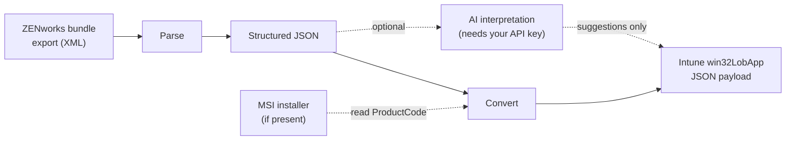

# 🔄 Zen2Intune

[](https://github.com/amansharmaa1/zen2intune/actions/workflows/test.yml)
[](LICENSE)


**Migrate application packages from ZENworks to Microsoft Intune — without hand-typing every field.**

Zen2Intune takes a **ZENworks bundle export** and produces a draft **Intune Win32 app
package** (install/uninstall commands, a detection rule, requirement rules, and
related fields) as JSON. For MSI-based bundles, it reads the installer file itself to
generate a working detection rule — no guessing at a product code.

> ⚠️ **The output is a strong draft, not a click-to-deploy package.** Some fields have
> no reliable source in ZENworks data and are left blank on purpose, with an
> explanation, instead of a fabricated guess. See
> [**Known Limitations**](docs/known-limitations.md) before you rely on it.

---

## 📋 Contents

- [What it does](#-what-it-does)
- [What it doesn't do yet](#-what-it-doesnt-do-yet)
- [Prerequisites](#-prerequisites)
- [Installing](#-installing)
- [Quick start](#-quick-start-convert-a-whole-export-directory)
- [Step by step](#-step-by-step-the-four-stages)
- [Running the tests](#-running-the-tests)
- [Known limitations](#-known-limitations)
- [Contributing](#-contributing)
- [License](#-license)

---

## ✨ What it does



1. **Parse** a ZENworks bundle export (XML) into its install actions, scripts,
   conditions, and dependencies.
2. **Normalize** that into a validated, canonical structured representation.
3. **Convert** it into an Intune Win32 app JSON payload — install/uninstall command
   lines, requirement rules, and (for MSI bundles with the installer file present) a
   real detection rule read directly from the MSI's own product code.
4. **Flag, don't guess.** Anything the tool can't derive with confidence is left out
   of the payload and listed separately, with a reason.
5. *(Optional)* **Ask an AI model** for a suggested resolution on flagged items — a
   suggestion for you to check, never an automatic fix.

## 🚧 What it doesn't do yet

- No live upload to an Intune tenant — you get a JSON file, and you create the app
  yourself (Intune admin center or Graph Explorer).
- No detection rule for **script-based** bundles — only MSI-based bundles with the
  installer file included in the export.
- No bulk/batch mode — one bundle export directory in, one payload out.
- No PowerShell deployment automation is generated. (Two small PowerShell scripts
  *are* used internally, Windows-only, purely to read MSI file properties.)

Full details: **[docs/known-limitations.md](docs/known-limitations.md)**.

## 📋 Prerequisites

- **Node.js 20 or later**
- No account needed for parsing/conversion. The optional AI step needs your own
  [Anthropic API key](https://console.anthropic.com/).

## 📦 Installing

```sh
npm install
```

## 🚀 Quick start: convert a whole export directory

Point it at a ZENworks bundle export directory (the folder holding the bundle's
`.xml`, its `_ActionContentInfo.xml` sidecar, and its `_content` folder with the
installer), and one call runs the entire pipeline:

```js
import { writeFileSync } from 'node:fs';
import { convertBundleExportDirectory } from './src/pipeline/convertBundleExport.js';

const { app, needsReview } = await convertBundleExportDirectory(
  'C:\\path\\to\\Bundles\\My App Bundle',
);

writeFileSync('intune-app.json', JSON.stringify(app, null, 2));
writeFileSync('needs-review.json', JSON.stringify(needsReview, null, 2));
```

📌 **Always read `needs-review.json` afterwards** — it lists everything that
couldn't be derived and still needs your attention.

## 🔍 Step by step: the four stages

There's no packaged CLI yet — each stage is a small function you call from a short
Node.js script.

<details>
<summary><strong>1. Parse a ZENworks bundle export</strong></summary>

```js
import { readFileSync } from 'node:fs';
import { parseBundleXml } from './src/parser/parseBundle.js';

const xml = readFileSync('my-bundle-export.xml', 'utf8');
const rawBundle = parseBundleXml(xml);
```

Malformed or incomplete XML throws an error rather than guessing — fix the input and
re-run.
</details>

<details>
<summary><strong>2. Build the structured JSON</strong></summary>

```js
import { normalizeBundle } from './src/schema/normalize.js';

const structuredBundle = normalizeBundle(rawBundle);
```
</details>

<details>
<summary><strong>3. Convert to an Intune Win32 app package</strong></summary>

```js
import { convertToIntunePackage } from './src/intune/convertBundle.js';

const { app, needsReview } = convertToIntunePackage(structuredBundle);

console.log(JSON.stringify(app, null, 2));
console.log(`${needsReview.length} item(s) need manual review.`);
```

To include a real detection rule for an MSI bundle, pass `msiProductInfo` (see
`src/msi/readMsiProductInfo.js` — or just use `convertBundleExportDirectory` from the
[quick start](#-quick-start-convert-a-whole-export-directory), which does this for
you).
</details>

<details>
<summary><strong>4. (Optional) AI interpretation</strong></summary>

For items in `needsReview`, ask an AI model (Claude) for a suggested resolution and a
confidence level — a suggestion to check, not an automatic fix.

Requires an Anthropic API key:

```sh
export ANTHROPIC_API_KEY=your-key-here
```

```js
import { interpretBundle } from './src/ai/anthropicProvider.js';

const { annotations } = await interpretBundle(structuredBundle);
console.log(annotations);
```

Without `ANTHROPIC_API_KEY` set, this throws `AiProviderNotConfiguredError` rather
than returning a made-up answer. This step makes a real, billed call to Anthropic's
API.
</details>

## 🧪 Running the tests

```sh
npm test
```

Runs the full suite with Node's built-in test runner. To run a single file:

```sh
node --test test/parser.test.js
```

## 📚 Known limitations

**[docs/known-limitations.md](docs/known-limitations.md)** is the plain-language
summary of what's not covered yet. For the full technical reasoning, decision
history, and documentation citations behind each item, see
[NEEDS_REVIEW.md](NEEDS_REVIEW.md).

## 🤝 Contributing

Contributions are welcome — see [CONTRIBUTING.md](CONTRIBUTING.md) for how to run
the tests, the phase/testing discipline this project follows, and the rule that
**real ZENworks bundle data must never be committed**.

## ⚠️ A note on real data

Never commit real ZENworks bundle exports, MSI files, or any file derived from your
actual environment to this repository — only synthetic, fake-valued sample data
belongs here.

## 📄 License

[MIT](LICENSE)

---

*This project was built with AI assistance (Claude / Claude Code).*
